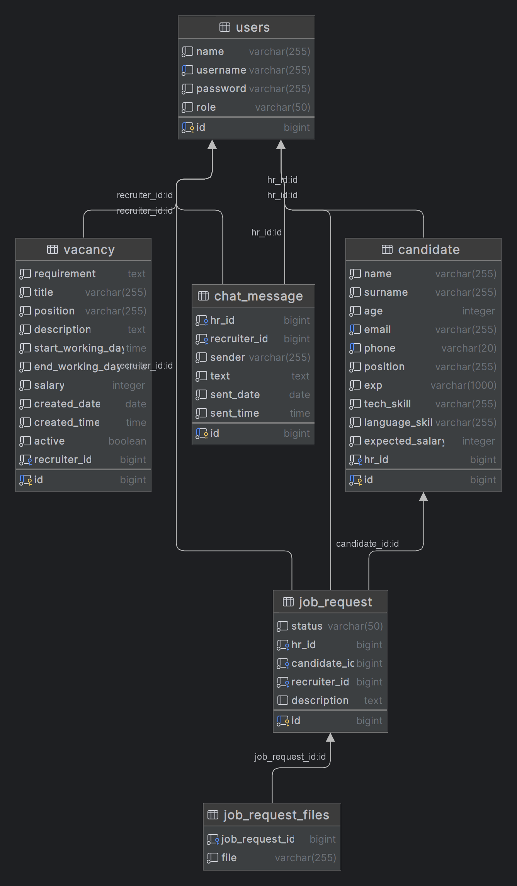

## Установка и запуск проекта

### Технологии

- Java 21 (Core, Collections, Optional, Stream)
- Apache Maven
- PostgreSQL
- Spring Framework (Spring Boot, Spring Security)
- Hibernate
- PostgreSQL
- Lombok, MapStruct
- Junit5, Mockito, Testcontainers
- Postman
- Docker
- liquibase

### Установка и настройка

1. Склонируйте репозиторий: git clone https://github.com/your-repository.git
2. Убедитесь, что у вас установлены Java, Maven и PostgreSQL.
3. Создайте базу данных в PostgreSQL и настройте соответствующие параметры в файле application.properties .
4. Соберите проект с помощью Maven:  mvn clean install .
5. Запустите приложение:  mvn spring-boot:run .

## Описание проекта

Данный проект представляет собой RESTful веб-приложение для управления наймом персонала. В приложении реализован
следующий функционал:

- Регистрация пользователей в системе (HR, специалисты для собеседований)
- Подача заявок на найм
- Просмотр списка заявок на найм с возможностью поиска и фильтрации
- Управление статусами заявок на найм
- Добавление, редактирование и удаление кандидатов
- Вложение файлов и добавление описания к заявке
- Личная переписка между HR специалистами и специалистами для собеседований

## Структура проекта

Проект разделен на следующие модули:

- controller - контроллеры для обработки запросов
- service - сервисы для бизнес-логики
- repository - репозитории для работы с базой данных
- model - модели данных
- config - конфигурации Spring Security, Open API, Mail и Minio
- exception - обработка исключительных ситуаций
- util - вспомогательные утилиты
- aspect - сквозные аспекты
- dto - DTO-объекты
- mapper - мапперы для преобразования DTO-объектов в модели данных и обратно
- security - классы для работы с Spring Security
- openapi - классы для работы с Open API
- validator - классы для валидации данных
- properties - классы зависмости
## Контроллеры

- **[CandidateController.java](src%2Fmain%2Fjava%2Fcom%2Fjava%2Frecruitment%2Fweb%2Fcontroller%2Fcandidate%2FCandidateController.java)**
    - **POST /candidate**
        - Описание: Создать кандидата
    - **GET /candidate**
        - Описание: Получить всех кандидатов
    - **GET /candidate/{id}**
        - Описание: Получить кандидата по ID
    - **PUT /candidate**
        - Описание: Изменить данные кандидата
    - **DELETE /candidate/{id}**
        - Описание: Удалить кандидата

- **[ChatController](src%2Fmain%2Fjava%2Fcom%2Fjava%2Frecruitment%2Fweb%2Fcontroller%2Fchat%2FChatController.java)**
    - **POST /messages**
        - Описание: Отправить сообщение
    - **GET /messages**
        - Описание: Получить все сообщения
    - **GET /messages/{id}**
        - Описание: Получить сообщение по ID

- **[HrJobRequestController](src%2Fmain%2Fjava%2Fcom%2Fjava%2Frecruitment%2Fweb%2Fcontroller%2FjobRequest%2FHrJobRequestController.java)**
    - **POST /hr/job-request**
        - Описание: Создание заявки на работу
    - **DELETE /hr/job-request/{id}**
        - Описание: Удалить заявку на работу по ID

- **[JobRequestController](src%2Fmain%2Fjava%2Fcom%2Fjava%2Frecruitment%2Fweb%2Fcontroller%2FjobRequest%2FJobRequestController.java)[JobRequestController](#jobrequestcontroller)**
    - **GET /job-request**
        - Описание: Получить все заявки
    - **GET /job-request/{id}**
        - Описание: Получить заявку по ID
    - **GET /job-request/{jobRequestId}**
        - Описание: Получить ссылку на скачивание файлов по ID заявки на работу

- **[RecruiterJobRequestController](src%2Fmain%2Fjava%2Fcom%2Fjava%2Frecruitment%2Fweb%2Fcontroller%2FjobRequest%2FRecruiterJobRequestController.java)**
    - **PUT /recruiter/job-request**
        - Описание: Изменить статус заявки

- **[RecruiterVacancyController](src%2Fmain%2Fjava%2Fcom%2Fjava%2Frecruitment%2Fweb%2Fcontroller%2Fvacancy%2FRecruiterVacancyController.java)**
    - **POST /recruiter/vacancy**
        - Описание: Опубликовать вакансию
    - **PUT /recruiter/vacancy**
        - Описание: Редактировать вакансию
    - **DELETE /recruiter/vacancy/{id}**
        - Описание: Удалить вакансию

- **[VacancyController](src%2Fmain%2Fjava%2Fcom%2Fjava%2Frecruitment%2Fweb%2Fcontroller%2Fvacancy%2FVacancyController.java)**
    - **GET /vacancy**
        - Описание: Получить все вакансии
    - **GET /vacancy/{id}**
        - Описание: Получить вакансию по ID

- **[AuthController](src%2Fmain%2Fjava%2Fcom%2Fjava%2Frecruitment%2Fweb%2Fcontroller%2FAuthController.java)**
    - **POST /api/v1/auth/login**
        - Описание: Авторизоваться
    - **POST /api/v1/auth/registration**
        - Описание: Зарегистрироваться
    - **POST /api/v1/auth/refresh**
        - Описание: Обновить токен

- **[UserController](src%2Fmain%2Fjava%2Fcom%2Fjava%2Frecruitment%2Fweb%2Fcontroller%2FUserController.java)**
    - **PUT /users**
        - Описание: Изменить данные пользователя
    - **GET /users/{id}**
        - Описание: Получить пользователя по идентификатору
    - **DELETE /users/{id}**
        - Описание: Удалить пользователя по идентификатору

## Тестирование

Проект содержит JUnit и Integration тесты, покрывающие основной функционал приложения.

## Логирование

Проект использует многоуровневую систему логирования для отслеживания действий и ошибок. Логи записываются в файлы для
последующего анализа.

## Дополнительные возможности

- Авторизация пользователей осуществляется с помощью Spring Security
- Проект соответствует принципам MVC и принципам "Сильного Сцепления" и "Слабой связанности"
- База данных приведена к 3-й нормальной форме
- Используются шаблоны проектирования для улучшения структуры приложения

## Документация

- Документация проекта: Наличие документации по проекту включает в себя Swagger и полную UML диаграмму.
- Документация Swagger доступна по следующим ссылкам:
    - http://your-domain/swagger-ui/index.html
    - http://your-domain/v3/api-docs
    - http://your-domain/swagger-resources

## UML Диаграмма

## Заключение

Данный проект реализует систему управления наймом персонала с использованием современных технологий Java. Приложение
соответствует всем требованиям ТЗ и готово к использованию.

**Автор**: Вербицицкий Глеб

**Дата создания**: 25.05.24